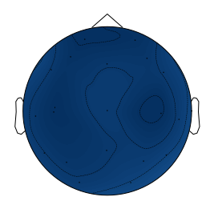
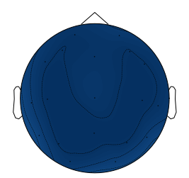

```python
# INSTALL Python3, CONDA, JUPYTER

# MAIN LIBRARIES USED:
# MNE
# MNE_FEATURES
# PYTHON MULTIPROCESSING, CONCURRENT, TIME
import numpy as np
```


```python
## READ A SAMPLE FILE TO EXTRACT SAMPLING FREQUENCY
import mne
import mne_features

mcifile=mne.io.read_raw_eeglab("/home/venkat/Downloads/submission/ClassifierTestsample/aMCI/CAUH_298.set")

```

    /home/venkat/miniconda3/lib/python3.6/importlib/_bootstrap.py:219: RuntimeWarning: numpy.ufunc size changed, may indicate binary incompatibility. Expected 192 from C header, got 216 from PyObject
      return f(*args, **kwds)
    /home/venkat/miniconda3/lib/python3.6/site-packages/mne_features/mock_numba.py:12: UserWarning: Numba not found. Your code will be slower.
      warn('Numba not found. Your code will be slower.')
    /home/venkat/miniconda3/lib/python3.6/importlib/_bootstrap.py:219: RuntimeWarning: numpy.ufunc size changed, may indicate binary incompatibility. Expected 192 from C header, got 216 from PyObject
      return f(*args, **kwds)
    /home/venkat/miniconda3/lib/python3.6/site-packages/sklearn/externals/joblib/__init__.py:15: DeprecationWarning: sklearn.externals.joblib is deprecated in 0.21 and will be removed in 0.23. Please import this functionality directly from joblib, which can be installed with: pip install joblib. If this warning is raised when loading pickled models, you may need to re-serialize those models with scikit-learn 0.21+.
      warnings.warn(msg, category=DeprecationWarning)
    <ipython-input-9-5c75e6e2da80>:5: RuntimeWarning: Data will be preloaded. preload=False or a string preload is not supported when the data is stored in the .set file
      mcifile=mne.io.read_raw_eeglab("/home/venkat/Downloads/submission/ClassifierTestsample/aMCI/CAUH_298.set")


```python
mcifile
```


    <RawEEGLAB  |  CAUH_298.set, n_channels x n_times : 19 x 11990 (59.9 sec), ~1.8 MB, data loaded>


```python
# CREATE FOLDER NAMED 'all'
# COPY BOTH /Normal and /aMCI FILES INTO /all

import os
from pathlib import Path
import mne as mne

allfolder="/home/venkat/Downloads/submission/ClassifierTestsample/all/"

allfiles = os.listdir(allfolder)
allfiles1=[]
for fi in allfiles:
    fn=(os.path.join('/home/venkat/Downloads/submission/ClassifierTestsample/all/', fi))
    f=mne.io.read_raw_eeglab(fn)
    allfiles1.append(f)
```

    <ipython-input-11-d023e05c39cd>:14: RuntimeWarning: Data will be preloaded. preload=False or a string preload is not supported when the data is stored in the .set file
      f=mne.io.read_raw_eeglab(fn)
    <ipython-input-11-d023e05c39cd>:14: RuntimeWarning: Data will be preloaded. preload=False or a string preload is not supported when the data is stored in the .set file
      f=mne.io.read_raw_eeglab(fn)
    <ipython-input-11-d023e05c39cd>:14: RuntimeWarning: Data will be preloaded. preload=False or a string preload is not supported when the data is stored in the .set file
      f=mne.io.read_raw_eeglab(fn)
    <ipython-input-11-d023e05c39cd>:14: RuntimeWarning: The data contains 'boundary' events, indicating data discontinuities. Be cautious of filtering and epoching around these events.
      f=mne.io.read_raw_eeglab(fn)
    <ipython-input-11-d023e05c39cd>:14: RuntimeWarning: Data will be preloaded. preload=False or a string preload is not supported when the data is stored in the .set file
      f=mne.io.read_raw_eeglab(fn)
    <ipython-input-11-d023e05c39cd>:14: RuntimeWarning: Limited 1 annotation(s) that were expanding outside the data range.
      f=mne.io.read_raw_eeglab(fn)
    <ipython-input-11-d023e05c39cd>:14: RuntimeWarning: The data contains 'boundary' events, indicating data discontinuities. Be cautious of filtering and epoching around these events.
      f=mne.io.read_raw_eeglab(fn)
    <ipython-input-11-d023e05c39cd>:14: RuntimeWarning: Data will be preloaded. preload=False or a string preload is not supported when the data is stored in the .set file
      f=mne.io.read_raw_eeglab(fn)
    <ipython-input-11-d023e05c39cd>:14: RuntimeWarning: Data will be preloaded. preload=False or a string preload is not supported when the data is stored in the .set file
      f=mne.io.read_raw_eeglab(fn)
    <ipython-input-11-d023e05c39cd>:14: RuntimeWarning: The data contains 'boundary' events, indicating data discontinuities. Be cautious of filtering and epoching around these events.
      f=mne.io.read_raw_eeglab(fn)
    <ipython-input-11-d023e05c39cd>:14: RuntimeWarning: Data will be preloaded. preload=False or a string preload is not supported when the data is stored in the .set file
      f=mne.io.read_raw_eeglab(fn)
    <ipython-input-11-d023e05c39cd>:14: RuntimeWarning: The data contains 'boundary' events, indicating data discontinuities. Be cautious of filtering and epoching around these events.
      f=mne.io.read_raw_eeglab(fn)
    <ipython-input-11-d023e05c39cd>:14: RuntimeWarning: Data will be preloaded. preload=False or a string preload is not supported when the data is stored in the .set file
      f=mne.io.read_raw_eeglab(fn)
    <ipython-input-11-d023e05c39cd>:14: RuntimeWarning: Data will be preloaded. preload=False or a string preload is not supported when the data is stored in the .set file
      f=mne.io.read_raw_eeglab(fn)
    <ipython-input-11-d023e05c39cd>:14: RuntimeWarning: The data contains 'boundary' events, indicating data discontinuities. Be cautious of filtering and epoching around these events.
      f=mne.io.read_raw_eeglab(fn)
    <ipython-input-11-d023e05c39cd>:14: RuntimeWarning: Data will be preloaded. preload=False or a string preload is not supported when the data is stored in the .set file
      f=mne.io.read_raw_eeglab(fn)
    <ipython-input-11-d023e05c39cd>:14: RuntimeWarning: The data contains 'boundary' events, indicating data discontinuities. Be cautious of filtering and epoching around these events.
      f=mne.io.read_raw_eeglab(fn)
    <ipython-input-11-d023e05c39cd>:14: RuntimeWarning: Data will be preloaded. preload=False or a string preload is not supported when the data is stored in the .set file
      f=mne.io.read_raw_eeglab(fn)
    <ipython-input-11-d023e05c39cd>:14: RuntimeWarning: Data will be preloaded. preload=False or a string preload is not supported when the data is stored in the .set file
      f=mne.io.read_raw_eeglab(fn)
    <ipython-input-11-d023e05c39cd>:14: RuntimeWarning: Data will be preloaded. preload=False or a string preload is not supported when the data is stored in the .set file
      f=mne.io.read_raw_eeglab(fn)
    <ipython-input-11-d023e05c39cd>:14: RuntimeWarning: The data contains 'boundary' events, indicating data discontinuities. Be cautious of filtering and epoching around these events.
      f=mne.io.read_raw_eeglab(fn)
    <ipython-input-11-d023e05c39cd>:14: RuntimeWarning: Data will be preloaded. preload=False or a string preload is not supported when the data is stored in the .set file
      f=mne.io.read_raw_eeglab(fn)
    <ipython-input-11-d023e05c39cd>:14: RuntimeWarning: Data will be preloaded. preload=False or a string preload is not supported when the data is stored in the .set file
      f=mne.io.read_raw_eeglab(fn)
    <ipython-input-11-d023e05c39cd>:14: RuntimeWarning: Data will be preloaded. preload=False or a string preload is not supported when the data is stored in the .set file
      f=mne.io.read_raw_eeglab(fn)
    <ipython-input-11-d023e05c39cd>:14: RuntimeWarning: The data contains 'boundary' events, indicating data discontinuities. Be cautious of filtering and epoching around these events.
      f=mne.io.read_raw_eeglab(fn)
    <ipython-input-11-d023e05c39cd>:14: RuntimeWarning: Data will be preloaded. preload=False or a string preload is not supported when the data is stored in the .set file
      f=mne.io.read_raw_eeglab(fn)
    <ipython-input-11-d023e05c39cd>:14: RuntimeWarning: Data will be preloaded. preload=False or a string preload is not supported when the data is stored in the .set file
      f=mne.io.read_raw_eeglab(fn)
    <ipython-input-11-d023e05c39cd>:14: RuntimeWarning: The data contains 'boundary' events, indicating data discontinuities. Be cautious of filtering and epoching around these events.
      f=mne.io.read_raw_eeglab(fn)
    <ipython-input-11-d023e05c39cd>:14: RuntimeWarning: Data will be preloaded. preload=False or a string preload is not supported when the data is stored in the .set file
      f=mne.io.read_raw_eeglab(fn)
    <ipython-input-11-d023e05c39cd>:14: RuntimeWarning: The data contains 'boundary' events, indicating data discontinuities. Be cautious of filtering and epoching around these events.
      f=mne.io.read_raw_eeglab(fn)
    <ipython-input-11-d023e05c39cd>:14: RuntimeWarning: Data will be preloaded. preload=False or a string preload is not supported when the data is stored in the .set file
      f=mne.io.read_raw_eeglab(fn)
    <ipython-input-11-d023e05c39cd>:14: RuntimeWarning: The data contains 'boundary' events, indicating data discontinuities. Be cautious of filtering and epoching around these events.
      f=mne.io.read_raw_eeglab(fn)


```python
print(allfiles1[0].info['sfreq'])
```


```python
allfiles1[0].n_times
```


```python
fn=(os.path.join('/home/venkat/Downloads/submission/ClassifierTestsample/all/', allfiles[0]))
f=mne.io.read_raw_eeglab(fn)
columns=f.ch_names
print(columns)
```

    ['Fp1-AVG', 'F3-AVG', 'C3-AVG', 'P3-AVG', 'O1-AVG', 'Fp2-AVG', 'F4-AVG', 'C4-AVG', 'P4-AVG', 'O2-AVG', 'F7-AVG', 'T3-AVG', 'T5-AVG', 'F8-AVG', 'T4-AVG', 'T6-AVG', 'FZ-AVG', 'CZ-AVG', 'PZ-AVG']


    <ipython-input-13-aa808821a290>:2: RuntimeWarning: Data will be preloaded. preload=False or a string preload is not supported when the data is stored in the .set file
      f=mne.io.read_raw_eeglab(fn)


```python
# specific frequency bands
FREQ_BANDS = {"delta": [0.5, 4.5],"theta": [4.5, 8.5],"alpha": [8.5, 11.5],"sigma": [11.5, 15.5],
                  "beta": [15.5, 30], "all": [0.5,45]}
```


```python
# MAKE FIXED LENGTH EPOCHS
epochs_data=[]
epochs=[]
for f in allfiles1:
    events = mne.make_fixed_length_events(f, id=1, duration=4.)
    epochs_train = mne.Epochs(f, events, tmin=0., tmax=4., baseline=None, reject=None, preload=True)
    epochs_data.append(epochs_train.get_data())
    epochs.append(epochs_train)
```


```python
def bandpower(data, sf, band, window_sec=None, relative=False):
    """Compute the average power of the signal x in a specific frequency band.

    Parameters
    ----------
    data : 1d-array
        Input signal in the time-domain.
    sf : float
        Sampling frequency of the data.
    band : list
        Lower and upper frequencies of the band of interest.
    window_sec : float
        Length of each window in seconds.
        If None, window_sec = (1 / min(band)) * 2
    relative : boolean
        If True, return the relative power (= divided by the total power of the signal).
        If False (default), return the absolute power.

    Return
    ------
    bp : float
        Absolute or relative band power.
    """
    from scipy.signal import welch
    from scipy.integrate import simps
    band = np.asarray(band)
    low, high = band

    # Define window length
    if window_sec is not None:
        nperseg = window_sec * sf
    else:
        nperseg = (2 / low) * sf
       
    # Compute the modified periodogram (Welch)
    freqs, psd = welch(data, sf, nperseg=nperseg)
    
    # Frequency resolution
    freq_res = freqs[1] - freqs[0]

    # Find closest indices of band in frequency vector
    idx_band = np.logical_and(freqs >= low, freqs <= high)

    # Integral approximation of the spectrum using Simpson's rule.
    bp = simps(psd[idx_band], dx=freq_res)

    if relative:
        bp = bp/simps(psd, dx=freq_res)
    return bp
```


```python
# COMPUTE ABSOLUTE AND RELATIVE BAND POWER
from scipy.fftpack import fft,fft2, fftshift

def calculate_band_powers(filenum,electrode, band):
    
    epoch_data = epochs_data[filenum]
    nepochs=len(epoch_data)
    channels=len(epoch_data[0])
    timepoints=len(epoch_data[0][0])
    
    alist = []
    for i in range(nepochs):  # number of epochs
        for j in range(channels): # number of electrodes
            if(j==electrode):
                for k in range(timepoints): # number of time points in epoch
                    alist.append(epoch_data[i][j][k])

    electrode=np.reshape(alist, (nepochs,timepoints))
    bp_sum=0
    for epoch in electrode:
        bp_sum+=bandpower(epoch, allfiles1[filenum].info['sfreq'], FREQ_BANDS[band], None, False)

    avg_bp_sum=bp_sum/nepochs
    return avg_bp_sum
```


```python
# TYPE1 RELATIVE POWER
def RP1(file_num):
    band_power_by_electrode=band_power_all[file_num]
    relative_band_powers={}
    for band in FREQ_BANDS:
        if(band!="all"):
            arr=[]
            for i in range(19):
                for j in range(19):
                    if(i<j):
                        bp1=band_power_by_electrode[band][i]
                        bp2=band_power_by_electrode[band][j]

                        rp1=(bp1-bp2)/(bp1+bp2)
                        arr.append(rp1)
            relative_band_powers[band]=arr

    return relative_band_powers
```


```python
# TYPE2 RELATIVE POWER
def RP2(file_num):
    band_power_by_electrode=band_power_all[file_num]
    relative_band_powers={}
    for band in FREQ_BANDS:
        if(band!="all"):
            arr=[]
            for i in range(19):
                for j in range(19):
                    if(i<j):
                        bp1=band_power_by_electrode[band][i]
                        bp2=band_power_by_electrode[band][j]
                        tp=band_power_by_electrode["all"][i]
                        wp1=bp1/tp
                        wp2=bp2/tp
                        rp3=wp1-wp2/(wp1+wp2)
                        arr.append(rp3)
            relative_band_powers[band]=arr

    return relative_band_powers
```


```python

## TAKES LONG TIME - 19.085 seconds for all 20 files
import concurrent
import time

band_power_all={}

def process(j):
    band_power_by_electrode={}
    for band in FREQ_BANDS:
        arr=[]
        for i in range(19):
            arr.append(calculate_band_powers(j,i, band))
        band_power_by_electrode[band]=arr
    
    band_power_all[j]=band_power_by_electrode
    return j, band_power_all[j]

if __name__=='__main__':
    start = time.time()
    with concurrent.futures.ProcessPoolExecutor(8) as executor:
        for row, result in executor.map(process, range(0,20)):
            band_power_all[row] = result

    print(time.time()-start)

```


```python
y=[None]*20
i=0
for fi in allfiles:
    fn=(os.path.join('/home/venkat/connectomes/ClassifierTestsample/all', fi))
    if(fi.startswith("C")):
        y[i]=1
    else:
        y[i]=0
    i=i+1
```


```python
print(y)
```

    [1, 1, 0, 0, 1, 0, 0, 1, 1, 0, 1, 1, 0, 0, 1, 1, 1, 0, 0, 0]


```python
# RELATIVE TYPE3 POWER
# 
def RP3(file_num):
    band_power_by_electrode=band_power_all[file_num]
    relative_band_powers={}
    for band in FREQ_BANDS:
        if(band!="all"):
            arr=[]
            for i in range(19):
                for j in range(19):
                    if(i<j):
                        bp1=band_power_by_electrode[band][i]
                        bp2=band_power_by_electrode[band][j]

                        rp1=np.log(bp1)-np.log(bp2)
                        arr.append(rp1)
            relative_band_powers[band]=arr

    return relative_band_powers
```


```python
RP1_band_power={}
RP2_band_power={}
RP3_band_power={}

for file_num in range(20):
    RP1_band_power[file_num]=RP1(file_num)
    RP2_band_power[file_num]=RP2(file_num)
    RP3_band_power[file_num]=RP3(file_num)
```


```python
# PARALLEL COMPUTATION OF NON LINEAR FEATURES
# HIGUCHI FRACTAL DIMENSION
# !!!!!!!CAUTION - SPEED DEPENDS ON HARDWARE

## AS THIS STEP MAY TAKE LONG TIME, I HAVE (MANUALLY) WRITTEN THE
# RESULTS OF THESE FUNCTIONS INTO CSV FILES
# CALLED HIGUCHI.CSV AND APPROXENT.CSV

import concurrent
import time
import mne_features

features_higuchi = np.zeros((20, 19))

def calculate_higuchi(i):
    higuchi=mne_features.univariate.compute_higuchi_fd(allfiles1[i].get_data())
    print(allfiles1[i], '------>', higuchi)
    return i, higuchi

if __name__=='__main__':
    start = time.time();
    with concurrent.futures.ProcessPoolExecutor(8) as executor:
        for row, result in executor.map(calculate_higuchi, range(20)):
            features_higuchi[row] = result

    print(time.time()-start)
```


```python
# PARALLEL COMPUTATION OF NON LINEAR FEATURES
# APPROXIMATE ENTROPY
# !!!!!!!CAUTION - SPEED DEPENDS ON HARDWARE

import concurrent
import time

features_approx_ent = np.zeros((20, 19))

def calculate_approx_entropy(i):
    approx_entropy=mne_features.univariate.compute_app_entropy(allfiles1[i].get_data())
    print(allfiles1[i], '------>', approx_entropy)
    return i, approx_entropy

if __name__=='__main__':
    start = time.time();
    with concurrent.futures.ProcessPoolExecutor(8) as executor:
        for row, result in executor.map(calculate_approx_entropy, range(20)):
            features_approx_ent[row] = result

    print(time.time()-start)
```


```python
print(np.savetxt("higuchi_features.csv", features_higuchi, delimiter=","))
```


```python
X_beta_R1=np.zeros((20,171))
for key in RP1_band_power.keys():
    X_beta_R1[key,:]=RP1_band_power[key]['beta']
    
X_beta_R2=np.zeros((20,171))
for key in RP2_band_power.keys():
    X_beta_R2[key,:]=RP2_band_power[key]['beta']
    
X_beta_R3=np.zeros((20,171))
for key in RP3_band_power.keys():
    X_beta_R3[key,:]=RP3_band_power[key]['beta']
```


```python
# ALPHAS ARE NAN - WHY?

X_sigma_R1=np.zeros((20,171))
for key in RP1_band_power.keys():
    X_sigma_R1[key,:]=RP1_band_power[key]['sigma']
    
X_sigma_R2=np.zeros((20,171))
for key in RP2_band_power.keys():
    X_sigma_R2[key,:]=RP2_band_power[key]['sigma']
    
X_sigma_R3=np.zeros((20,171))
for key in RP3_band_power.keys():
    X_sigma_R3[key,:]=RP3_band_power[key]['sigma']
```


```python
X_theta_R1=np.zeros((20,171))
for key in RP1_band_power.keys():
    X_theta_R1[key,:]=RP1_band_power[key]['theta']
    
X_theta_R2=np.zeros((20,171))
for key in RP2_band_power.keys():
    X_theta_R2[key,:]=RP2_band_power[key]['theta']
    
X_theta_R3=np.zeros((20,171))
for key in RP3_band_power.keys():
    X_theta_R3[key,:]=RP3_band_power[key]['theta']
```


```python
# WHY ARE ALL ALPHAS ZERO?
X_alpha_R1=np.zeros((20,171))
for key in RP1_band_power.keys():
    X_alpha_R1[key,:]=RP1_band_power[key]['alpha']
    
X_alpha_R2=np.zeros((20,171))
for key in RP2_band_power.keys():
    X_alpha_R2[key,:]=RP2_band_power[key]['alpha']
    
X_alpha_R3=np.zeros((20,171))
for key in RP3_band_power.keys():
    X_alpha_R3[key,:]=RP3_band_power[key]['alpha']
```


```python
X_delta_R1=np.zeros((20,171))
for key in RP1_band_power.keys():
    X_beta_R1[key,:]=RP1_band_power[key]['beta']

X_delta_R2=np.zeros((20,171))
for key in RP2_band_power.keys():
    X_beta_R2[key,:]=RP2_band_power[key]['beta']
    
X_delta_R3=np.zeros((20,171))
for key in RP3_band_power.keys():
    X_beta_R3[key,:]=RP3_band_power[key]['beta']
```


```python
print(X_delta_R1)
```


```python

from sklearn.ensemble import RandomForestClassifier
from sklearn.model_selection import StratifiedKFold, cross_val_score
from sklearn.pipeline import Pipeline, make_pipeline
from sklearn.linear_model import LogisticRegression
from sklearn.linear_model import RidgeClassifier
from sklearn import neighbors
from sklearn import svm
from sklearn.discriminant_analysis import LinearDiscriminantAnalysis, QuadraticDiscriminantAnalysis
from sklearn.naive_bayes import GaussianNB

from mne_features.feature_extraction import FeatureExtractor

###############################################################################

pipe = Pipeline([('clf', RandomForestClassifier(n_estimators=100,max_depth=4,random_state=42))])
pipe_logistic=Pipeline([('clf', LogisticRegression(solver='lbfgs', max_iter=1000,multi_class='ovr'))])
pipe_knn = Pipeline([('clf', neighbors.KNeighborsClassifier())])
pipe_svc = Pipeline([('clf', svm.SVC(kernel='poly', gamma='auto', C=10.0))])
pipe_gb = Pipeline([('clf', GaussianNB())])
pipe_ridge = Pipeline([('clf', RidgeClassifier())])
pipe_lda=Pipeline([('clf', LinearDiscriminantAnalysis())])
pipe_qda=Pipeline([('clf', QuadraticDiscriminantAnalysis())])


skf = StratifiedKFold(n_splits=9, random_state=42)

###############################################################################
# Print the cross-validation accuracy score:
scores_randomforest = cross_val_score(pipe, X_delta_R2, y, cv=skf)
scores_logistic = cross_val_score(pipe_logistic, X_delta_R2, y, cv=skf)
scores_knn = cross_val_score(pipe_knn, X_delta_R2, y, cv=skf)
scores_svc = cross_val_score(pipe_svc, X_delta_R2, y, cv=skf)
scores_gb = cross_val_score(pipe_gb, X_delta_R2, y, cv=skf)
scores_ridge = cross_val_score(pipe_ridge, X_delta_R2, y, cv=skf)

scores_lda = cross_val_score(pipe_lda, X_delta_R2, y, cv=skf)
scores_qda = cross_val_score(pipe_qda, X_delta_R2, y, cv=skf)

print('Random forest accuracy = ' , (np.mean(scores_randomforest),np.std(scores_randomforest)))
print('Logistic regression accuracy = ' , (np.mean(scores_logistic),np.std(scores_logistic)))
print('KNN accuracy = ' , (np.mean(scores_knn),np.std(scores_knn)))
print('SVC accuracy = ' , (np.mean(scores_svc),np.std(scores_svc)))
print('Naive Bayes accuracy = ' , (np.mean(scores_gb),np.std(scores_gb)))
print('Ridge accuracy = ' , (np.mean(scores_ridge),np.std(scores_gb)))

print('LDA accuracy = ', np.mean(scores_lda))
print('QDA accuracy = ', np.mean(scores_qda))

```


```python
!pip install pactools
```


```python
import pactools as pac
```


```python
import numpy as np
import matplotlib.pyplot as plt

from pactools import Comodulogram, REFERENCES
from pactools import simulate_pac


###############################################################################
# Let's first create an artificial signal with PAC.

fs = 200.  # Hz
high_fq = 4.5  # Hz
low_fq = 0.5  # Hz
low_fq_width = 1.0  # Hz

n_points = 10000
noise_level = 0.4

signal=allfiles1[16].get_data()

###############################################################################
# Then, let's define the range of low frequency, and the list of methods used

low_fq_range = np.linspace(8,12, 10)
methods=['bispectrum']

###############################################################################
# To compute the comodulogram, we need to instanciate a `Comodulogram` object,
# then call the method `fit`. The method `plot` draws the results on the given
# subplot axes.

# Define the subplots where the comodulogram will be plotted
#n_lines = 3
#n_columns = int(np.ceil(len(methods) / float(n_lines)))
#fig, axs = plt.subplots(
#    n_lines, n_columns, figsize=(4 * n_columns, 3 * n_lines))
#axs = axs.ravel()

mean_bispectrum_vals=np.zeros((19,))
import pandas as pd
locs=pd.read_csv("/home/venkat/Downloads/submission/ClassifierTestsample/10-20system.csv")
for ch in range(0,signal.shape[0]):
# Compute the comodulograms and plot them
    estimator = Comodulogram(fs=fs, low_fq_range=low_fq_range,
                             low_fq_width=low_fq_width, method=method,
                             progress_bar=False)
    estimator.fit(signal[ch,:])
    #estimator.plot(titles=[REFERENCES[method]], axs=[ax])

    mean_bispectrum_vals[ch,]=np.mean(estimator.comod_)

#plt.show()import pandas as pd

```


```python
mne.viz.plot_topomap(mean_bispectrum_vals, eeg_locs_2d)
```





    (<matplotlib.image.AxesImage at 0x7f1dbd606668>,
     <matplotlib.contour.QuadContourSet at 0x7f1dbd606320>)


```python
y
```


    [1, 1, 0, 0, 1, 0, 0, 1, 1, 0, 1, 1, 0, 0, 1, 1, 1, 0, 0, 0]


```python
eeg_locs_2d=pd.read_csv('/home/venkat/Downloads/submission/ClassifierTestsample/eeg_10_20.csv', header=None)
eeg_locs_2d
```


<div>
<style scoped>
    .dataframe tbody tr th:only-of-type {
        vertical-align: middle;
    }

    .dataframe tbody tr th {
        vertical-align: top;
    }

    .dataframe thead th {
        text-align: right;
    }
</style>
<table border="1" class="dataframe">
  <thead>
    <tr style="text-align: right;">
      <th></th>
      <th>0</th>
      <th>1</th>
      <th>2</th>
    </tr>
  </thead>
  <tbody>
    <tr>
      <th>0</th>
      <td>C3</td>
      <td>-0.3249</td>
      <td>0.0000</td>
    </tr>
    <tr>
      <th>1</th>
      <td>C4</td>
      <td>0.3249</td>
      <td>0.0000</td>
    </tr>
    <tr>
      <th>2</th>
      <td>Cz</td>
      <td>0.0000</td>
      <td>0.0000</td>
    </tr>
    <tr>
      <th>3</th>
      <td>F3</td>
      <td>-0.2744</td>
      <td>0.3467</td>
    </tr>
    <tr>
      <th>4</th>
      <td>F4</td>
      <td>0.2744</td>
      <td>0.3467</td>
    </tr>
    <tr>
      <th>5</th>
      <td>F7</td>
      <td>-0.5879</td>
      <td>0.4270</td>
    </tr>
    <tr>
      <th>6</th>
      <td>F8</td>
      <td>0.5879</td>
      <td>0.4270</td>
    </tr>
    <tr>
      <th>7</th>
      <td>Fp1</td>
      <td>-0.2245</td>
      <td>0.6910</td>
    </tr>
    <tr>
      <th>8</th>
      <td>Fp2</td>
      <td>0.2245</td>
      <td>0.6910</td>
    </tr>
    <tr>
      <th>9</th>
      <td>Fpz</td>
      <td>0.0000</td>
      <td>0.7266</td>
    </tr>
    <tr>
      <th>10</th>
      <td>Fz</td>
      <td>0.0000</td>
      <td>0.3249</td>
    </tr>
    <tr>
      <th>11</th>
      <td>O1</td>
      <td>-0.2245</td>
      <td>-0.6910</td>
    </tr>
    <tr>
      <th>12</th>
      <td>O2</td>
      <td>0.2245</td>
      <td>-0.6910</td>
    </tr>
    <tr>
      <th>13</th>
      <td>Oz</td>
      <td>0.0000</td>
      <td>-0.7266</td>
    </tr>
    <tr>
      <th>14</th>
      <td>P3</td>
      <td>-0.2744</td>
      <td>-0.3467</td>
    </tr>
    <tr>
      <th>15</th>
      <td>P4</td>
      <td>0.2744</td>
      <td>-0.3467</td>
    </tr>
    <tr>
      <th>16</th>
      <td>P7</td>
      <td>-0.5879</td>
      <td>-0.4270</td>
    </tr>
    <tr>
      <th>17</th>
      <td>P8</td>
      <td>0.5879</td>
      <td>-0.4270</td>
    </tr>
    <tr>
      <th>18</th>
      <td>Pz</td>
      <td>0.0000</td>
      <td>-0.3249</td>
    </tr>
    <tr>
      <th>19</th>
      <td>T7</td>
      <td>-0.7266</td>
      <td>0.0000</td>
    </tr>
    <tr>
      <th>20</th>
      <td>T8</td>
      <td>0.7266</td>
      <td>0.0000</td>
    </tr>
  </tbody>
</table>
</div>


```python

```





    (<matplotlib.image.AxesImage at 0x7f1dbde57dd8>,
     <matplotlib.contour.QuadContourSet at 0x7f1dbde57a20>)


```python
for i in range(0,19):
    allfiles1[0].info['chs'][i]['locs']=
```


      File "<ipython-input-170-8e94d606e11f>", line 2
        allfiles1[0].info['chs'][i]['locs']=
                                            ^
    SyntaxError: invalid syntax


```python
FREQ_BANDS
```


    {'delta': [0.5, 4.5],
     'theta': [4.5, 8.5],
     'alpha': [8.5, 11.5],
     'sigma': [11.5, 15.5],
     'beta': [15.5, 30],
     'all': [0.5, 45]}


```python
FREQ_BANDS['delta']
```


    [0.5, 4.5]


```python
allfiles1[0].get_data().shape
```


    (19, 11990)


```python
signal.shape[0]
```


    19


```python
low_fq_range
```


    array([[0.5       , 4.5       ],
           [0.57142857, 4.48979592],
           [0.64285714, 4.47959184],
           [0.71428571, 4.46938776],
           [0.78571429, 4.45918367],
           [0.85714286, 4.44897959],
           [0.92857143, 4.43877551],
           [1.        , 4.42857143],
           [1.07142857, 4.41836735],
           [1.14285714, 4.40816327],
           [1.21428571, 4.39795918],
           [1.28571429, 4.3877551 ],
           [1.35714286, 4.37755102],
           [1.42857143, 4.36734694],
           [1.5       , 4.35714286],
           [1.57142857, 4.34693878],
           [1.64285714, 4.33673469],
           [1.71428571, 4.32653061],
           [1.78571429, 4.31632653],
           [1.85714286, 4.30612245],
           [1.92857143, 4.29591837],
           [2.        , 4.28571429],
           [2.07142857, 4.2755102 ],
           [2.14285714, 4.26530612],
           [2.21428571, 4.25510204],
           [2.28571429, 4.24489796],
           [2.35714286, 4.23469388],
           [2.42857143, 4.2244898 ],
           [2.5       , 4.21428571],
           [2.57142857, 4.20408163],
           [2.64285714, 4.19387755],
           [2.71428571, 4.18367347],
           [2.78571429, 4.17346939],
           [2.85714286, 4.16326531],
           [2.92857143, 4.15306122],
           [3.        , 4.14285714],
           [3.07142857, 4.13265306],
           [3.14285714, 4.12244898],
           [3.21428571, 4.1122449 ],
           [3.28571429, 4.10204082],
           [3.35714286, 4.09183673],
           [3.42857143, 4.08163265],
           [3.5       , 4.07142857],
           [3.57142857, 4.06122449],
           [3.64285714, 4.05102041],
           [3.71428571, 4.04081633],
           [3.78571429, 4.03061224],
           [3.85714286, 4.02040816],
           [3.92857143, 4.01020408],
           [4.        , 4.        ]])


```python
mean_bispectrum_vals[1,]
```


    array([0.])


```python
allfiles1[0].info
```


    <Info | 17 non-empty fields
        bads : list | 0 items
        ch_names : list | Fp1-AVG, F3-AVG, C3-AVG, P3-AVG, O1-AVG, Fp2-AVG, ...
        chs : list | 19 items (EEG: 19)
        comps : list | 0 items
        custom_ref_applied : bool | False
        dev_head_t : Transform | 3 items
        dig : list | 19 items (19 EEG)
        events : list | 0 items
        highpass : float | 0.0 Hz
        hpi_meas : list | 0 items
        hpi_results : list | 0 items
        lowpass : float | 100.0 Hz
        meas_date : NoneType | unspecified
        nchan : int | 19
        proc_history : list | 0 items
        projs : list | 0 items
        sfreq : float | 200.0 Hz
        acq_pars : NoneType
        acq_stim : NoneType
        ctf_head_t : NoneType
        description : NoneType
        dev_ctf_t : NoneType
        experimenter : NoneType
        file_id : NoneType
        gantry_angle : NoneType
        hpi_subsystem : NoneType
        kit_system_id : NoneType
        line_freq : NoneType
        meas_id : NoneType
        proj_id : NoneType
        proj_name : NoneType
        subject_info : NoneType
        xplotter_layout : NoneType
    >


```python
eeg_locs=pd.read_csv('/home/venkat/Downloads/submission/ClassifierTestsample/10-20system.csv', header=None, thousands=',')
eeg_locs
```


<div>
<style scoped>
    .dataframe tbody tr th:only-of-type {
        vertical-align: middle;
    }

    .dataframe tbody tr th {
        vertical-align: top;
    }

    .dataframe thead th {
        text-align: right;
    }
</style>
<table border="1" class="dataframe">
  <thead>
    <tr style="text-align: right;">
      <th></th>
      <th>0</th>
      <th>1</th>
      <th>2</th>
    </tr>
  </thead>
  <tbody>
    <tr>
      <th>0</th>
      <td>−21.5</td>
      <td>70.2</td>
      <td>−0.1</td>
    </tr>
    <tr>
      <th>1</th>
      <td>−35.5</td>
      <td>49.4</td>
      <td>32.4</td>
    </tr>
    <tr>
      <th>2</th>
      <td>−52.2</td>
      <td>−16.4</td>
      <td>57.8</td>
    </tr>
    <tr>
      <th>3</th>
      <td>−39.5</td>
      <td>−76.3</td>
      <td>47.4</td>
    </tr>
    <tr>
      <th>4</th>
      <td>−26.8</td>
      <td>−100.2</td>
      <td>12.8</td>
    </tr>
    <tr>
      <th>5</th>
      <td>28.4</td>
      <td>69.1</td>
      <td>−0.4</td>
    </tr>
    <tr>
      <th>6</th>
      <td>40.2</td>
      <td>47.6</td>
      <td>32.1</td>
    </tr>
    <tr>
      <th>7</th>
      <td>54.1</td>
      <td>−18.0</td>
      <td>57.5</td>
    </tr>
    <tr>
      <th>8</th>
      <td>36.8</td>
      <td>−74.9</td>
      <td>49.2</td>
    </tr>
    <tr>
      <th>9</th>
      <td>24.1</td>
      <td>−100.5</td>
      <td>14.1</td>
    </tr>
    <tr>
      <th>10</th>
      <td>−54.8</td>
      <td>33.9</td>
      <td>−3.5</td>
    </tr>
    <tr>
      <th>11</th>
      <td>−70.2</td>
      <td>−21.3</td>
      <td>−10.7</td>
    </tr>
    <tr>
      <th>12</th>
      <td>−61.5</td>
      <td>−65.3</td>
      <td>1.1</td>
    </tr>
    <tr>
      <th>13</th>
      <td>56.6</td>
      <td>30.8</td>
      <td>−4.1</td>
    </tr>
    <tr>
      <th>14</th>
      <td>71.9</td>
      <td>−25.2</td>
      <td>−8.2</td>
    </tr>
    <tr>
      <th>15</th>
      <td>59.3</td>
      <td>−67.6</td>
      <td>3.8</td>
    </tr>
    <tr>
      <th>16</th>
      <td>0.6</td>
      <td>40.9</td>
      <td>53.9</td>
    </tr>
    <tr>
      <th>17</th>
      <td>0.8</td>
      <td>−14.7</td>
      <td>73.9</td>
    </tr>
    <tr>
      <th>18</th>
      <td>0.2</td>
      <td>−62.1</td>
      <td>64.5</td>
    </tr>
  </tbody>
</table>
</div>


```python
eeg_locs_2d=eeg_locs.iloc[:,:2]
```


```python
eeg_locs_2d.astype(np.float)
```


    ---------------------------------------------------------------------------

    ValueError                                Traceback (most recent call last)

    <ipython-input-141-69b0ed53abd4> in <module>
    ----> 1 eeg_locs_2d.astype(np.float)
    

    ~/miniconda3/lib/python3.6/site-packages/pandas/core/generic.py in astype(self, dtype, copy, errors)
       5696         else:
       5697             # else, only a single dtype is given
    -> 5698             new_data = self._data.astype(dtype=dtype, copy=copy, errors=errors)
       5699             return self._constructor(new_data).__finalize__(self)
       5700 


    ~/miniconda3/lib/python3.6/site-packages/pandas/core/internals/managers.py in astype(self, dtype, copy, errors)
        580 
        581     def astype(self, dtype, copy: bool = False, errors: str = "raise"):
    --> 582         return self.apply("astype", dtype=dtype, copy=copy, errors=errors)
        583 
        584     def convert(self, **kwargs):


    ~/miniconda3/lib/python3.6/site-packages/pandas/core/internals/managers.py in apply(self, f, filter, **kwargs)
        440                 applied = b.apply(f, **kwargs)
        441             else:
    --> 442                 applied = getattr(b, f)(**kwargs)
        443             result_blocks = _extend_blocks(applied, result_blocks)
        444 


    ~/miniconda3/lib/python3.6/site-packages/pandas/core/internals/blocks.py in astype(self, dtype, copy, errors)
        623             vals1d = values.ravel()
        624             try:
    --> 625                 values = astype_nansafe(vals1d, dtype, copy=True)
        626             except (ValueError, TypeError):
        627                 # e.g. astype_nansafe can fail on object-dtype of strings


    ~/miniconda3/lib/python3.6/site-packages/pandas/core/dtypes/cast.py in astype_nansafe(arr, dtype, copy, skipna)
        895     if copy or is_object_dtype(arr) or is_object_dtype(dtype):
        896         # Explicit copy, or required since NumPy can't view from / to object.
    --> 897         return arr.astype(dtype, copy=True)
        898 
        899     return arr.view(dtype)


    ValueError: could not convert string to float: '−21.5'


```python
data = eeg_locs_2d.apply(pd.to_numeric, errors='coerce')
```


```python
eeg_locs_2d=np.empty((19,2))
eeg_locs_2d[0,:]=[-21.5,70.2]
eeg_locs_2d[1,:]=[-35.5,49.4]
eeg_locs_2d[2,:]=[-52.2,-16.4]
eeg_locs_2d[3,:]=[-39.5,-76.3]
eeg_locs_2d[4,:]=[-26.8,-100.2]
eeg_locs_2d[5,:]=[28.4,69.1]
eeg_locs_2d[6,:]=[40.2,47.6]
eeg_locs_2d[7,:]=[54.1,-18.0]
eeg_locs_2d[8,:]=[36.8,-74.9]
eeg_locs_2d[9,:]=[24.1,-100.5]
eeg_locs_2d[10,:]=[-54.8,33.9]
eeg_locs_2d[11,:]=[-70.2,-21.3]
eeg_locs_2d[12,:]=[-61.5,-65.3]
eeg_locs_2d[13,:]=[56.6,30.8]
eeg_locs_2d[14,:]=[71.9,-25.2]
eeg_locs_2d[15,:]=[59.3,-67.6]
eeg_locs_2d[16,:]=[0.6,40.9]
eeg_locs_2d[17,:]=[0.8,-14.7]
eeg_locs_2d[18,:]=[0.2,-62.1]
```


```python
np.array(eeg_locs_2d)
```


    array([list([-21.5, 70.2]), list([-35.5, 49.4]), list([-52.2, -16.4]),
           list([-115.8]), list([-26.8, -100.2]), list([28.4, 69.1]),
           list([40.2, 47.6]), list([54.1, -18.0]), list([36.8, -74.9]),
           list([24.1, -100.5]), list([-54.8, 33.9]), list([-91.5]),
           list([-61.5, -65.3]), list([56.6, 30.8]), list([71.9, -25.2]),
           list([59.3, -67.6]), list([0.6, 40.9]),
           list([-13.899999999999999]), list([-61.9])], dtype=object)


```python
21.5	70.2	−0.1
1	−35.5	49.4	32.4
2	−52.2	−16.4	57.8
3	−39.5	−76.3	47.4
4	−26.8	−100.2	12.8
5	28.4	69.1	−0.4
6	40.2	47.6	32.1
7	54.1	−18.0	57.5
8	36.8	−74.9	49.2
9	24.1	−100.5	14.1
10	−54.8	33.9	−3.5
11	−70.2	−21.3	−10.7
12	−61.5	−65.3	1.1
13	56.6	30.8	−4.1
14	71.9	−25.2	−8.2
15	59.3	−67.6	3.8
16	0.6	40.9	53.9
17	0.8	−14.7	73.9
18	0.2	−62.1	64.5
```
