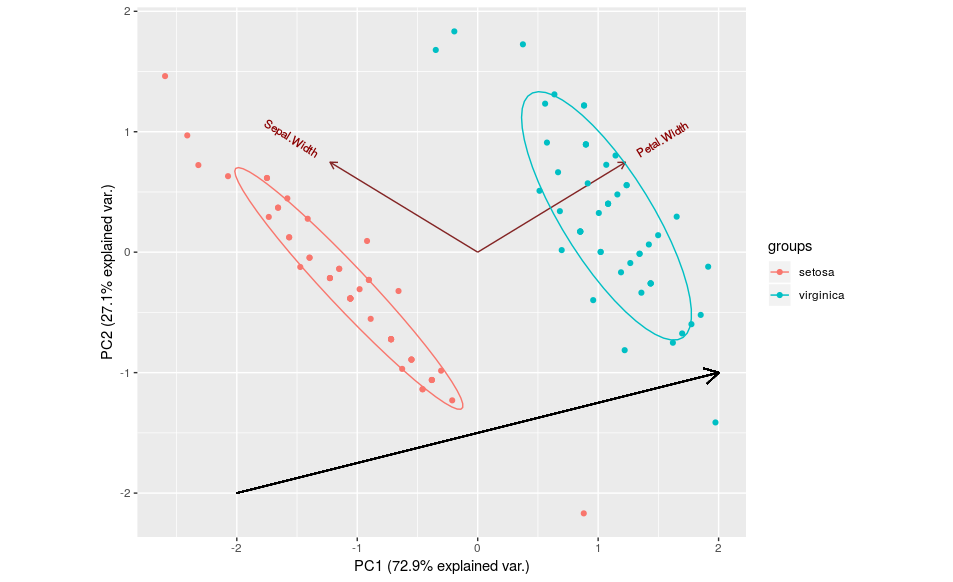
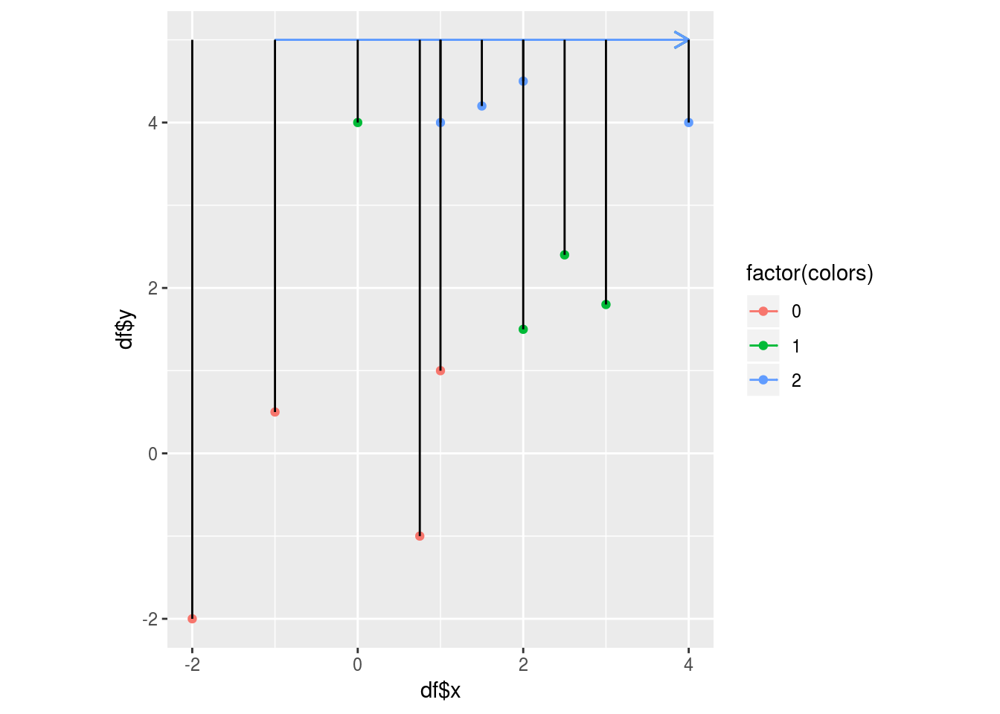

# Introduction

Fisher's Discriminant Analysis (hitherto referred to as _FDA_) is a dimensionality reduction method in statistical data analysis. In this article, we aim to discuss FDA in detail, both mathematically and implementation-wise. Given a labelled dataset _D_ in _d_ dimensions, d>=2, with _K_ output class labels, _FDA_ aims to find a _discriminant_ in a lower dimension $$d1\<\d$$ onto which _D_ is projected. The projected data points belonging to the _K_ classes are easily seperated on this discriminant. 

Figure 1:

Imagine dropping a perpendicular line from all the points onto the black line. The red points would be clearly seperated from the blue points on this line. 
Now imagine dropping a perpendicular line from all the points onto the green line. The red points and the blue points will not be as well seperated. So, the black line is a better discriminant in this case. 

Fisher's discriminant analysis was first introduced by R.A. Fisher. ([Fisher, 1936]references.html/#Fisher1936)). Fisher's discriminant analysis is a supervised data analysis technique. This means that the data samples need to be labelled as belonging to one of the output classes. Formally, given dataset _X_ having _n_ samples and _d_ features (or dimensions). Each sample belongs to one of _K_ output labels. _X_ is a $$(n,d)$$ matrix. Y is the output label vector of length $$(n,1)$$. 

As in Fig1 where _d=2_ and _K=2_, Fisher's discriminant analysis aims to:

1. Find the Fisher's discriminant(s) which is a line _L_ in this case
2. Orthogonally project the original dataset _X_ onto _L_
3. Seprate the data points belonging to the K different classes using a threshold. 

Before going any further, let us also discuss the number of Fisher's discriminants needed as _K_ increases. 

## Number of Fisher's discriminants required

Consider that, in _d=2_, there are _K=3_ classes of data samples. Will 1 Fisher's discriminant still suffice to classify the data samples into 3 classes ? Take the example of Fig2. 

Figure 2:

Dropping perpendicular lines from the blue, green and red points onto the yellow line seperates the red points clearly from the rest of the points. But there is some overlap between the blue and green points. Instead, imagine dropping a perpendicular line from the points to the purple line. Here, the blue and the green points are seperated perfectly. So, in this case, where K=3, we need 2 discriminants to seperate the 3 groups of points. Actually, given data X in dimension _d_ belonging to _K_ output classes, the minimum number of Fisher's discriminants needed to seperate the _K_ groups of samples is $$min(K-1,d)$$. For the sake of understanding, the reader is encouraged to experiment with _K>3_ in _d=2_ and find out the number of Fisher's discriminants necessary. 

## A formal definition of FDA

Given dataset _X_ in _d_ dimensions where each data sample $$x~i$$ is assigned one of _K_ output class labels. Fisher's discriminant analysis aims to find a suitable _w_ such that $$_X.w_$$ will orthogonally project _X_ onto a lower dimensional subspace _Y_ in dimension $$d'=min(K-1,d)$$. FDA tries to find _w_ such that:

$$Y=X.w$$

_X_ is a $$(n,d)$$ dimension matrix. _w_is a $$(d, min(K-1,d))$$ dimensional matrix. Thus, _Y_ is a $$(n, min(K-1,d))$$ matrix of orthogonal projections of the original dataset _X_ onto the Fisher's discriminant _w_. 

## A Visual intuition for FDA

The core idea behind Fisher's is that, if there are such discriminant(s) that provide good seperability to the data, then the discriminant(s) can do so by maximizing this seperatedness between each group of points while making each individual group of points as compact as possible. Maximizing seperatedness between different groups of points of different classes is akin to maximizing the distances between the mean of each group of points. Making each group of points compact is akin to minimizing the euclidean distances between points in a group andd their respective mean. We will see more on this below. 

## Derivation of Fisher's discriminant(s)

Let $$S~T$$ be the overall mean of the dataset _X_. Let $$X~i$$ be the data belonging to the $$i^th$$ output label, $$i \in (1,K)$$. 

The main motivating trigger behind this book has been my long standing obsession to understand the historical development of Partial Least Squares methods in order to find the who's, why's, what's, when's, and how's. It is the result of an intermittent 10 year quest, tracking bits and pieces of information in order to assemble the story of such methods. Moreover, this text is my third iteration on the subject, following two of my previous works: chapter 2 _"Historical Review"_ of my PhD thesis ([Sanchez, 2009](references.html/#Sanchez2009)), and the appendix _"A Historical Overview of PLS-PM"_ from my book _PLS Path Modeling with R_ ([Sanchez, 2013](references.html/#Sanchez2013)). 



This is NOT a technical book. It doesn't cover theory, methodological aspects, nor technical details of how the various PLS methods work (no discussions about algebra, computational steps, interpretation issues, etc.). This is also not a book written with a particular reader in mind. Instead, I've written its content to organize the vast material I've collected so far, which includes not only information from papers, chapters, proceedings, and books, but also thoughts, memories, analysis, interpretations, and personal opinions. Having said that, I imagine that this book can be used as a __companion reading__ for any course, workshop, or seminar about PLS methods, expecting to be enjoyed by anyone interested on this topic. Regardless of whether you're just taking your first steps on the PLS arena, or if you've already traveled a long way around PLS territory, I'm sure you'll find some value in the content of this work.

By writing this book, my aim is to shed some light about the teaching and understanding of the historical background surrounding Partial Least Squares methods. I'm convinced that this material will provide a fresh perspective and create awareness, debunk myths, and clarify misunderstandings. I'm not the one to judge whether the story of PLS has elements of an heroic tale. But I can tell you for sure that this story is formed with a long and complicated series of events, having scandinavian authors as protagonists. Hence the meaning of the title "The Saga of PLS."

## The proof of the pudding

In his classic _"Soft Modeling: The Basic Design and Some Extensions,"_ Herman  ([Wold, 1982b](references.html/#Wold1982b)), includes the following footnote on page 24: 

> Most nonlinear iterative techniques of estimation are lacking an analytic proof of convergence. The proof of the pudding is in the eating. 

Referring to the lack of a proof of convergence for his algorithm---when applied to the general case of multiple relations among multiple sets of variables---, Wold turned to the old saying of the __proof of the pudding__ to invite readers to try for themselves his methodology. Michel Tenenhaus (pronounced _Tenen-os_), a French statistician and world renowned PLS expert, has also used the same famous saying when presenting Partial Least Squares methods to new audiences. For many years, Michel has included William Camden's (1623) version "All the proofs of a pudding are in the eating, not in the cooking," in the last slide of most of his presentations about PLS, inviting users to _taste_ the method and experience for themselves whether they like it or not. 

For almost three decades, the convergence of Herman's main algorithm was an unresolved issue. This was due in part to the various options in which the algorithm can be specified. Depending on the input settings, computations converge most of the times. But there are a few exceptions. Today, we have a much better understanding of the mechanics of the algorithm, and it is possible to prove the convergence under certain circumstances. Unlike Wold, we also have a better comprehension of how the steps operate, and we can even tweak the algorithm in a such a way that we are certain of what's going on inside of it. Thanks to these advancements, a couple of years ago, Tenenhaus slightly modified the pudding phrase to:

> All the proofs of a pudding are in the eating... but it will taste even better if you know the cooking.

He's right. Let me add to it that it doesn't hurt to know about the story and history behind the recipes, their chefs, their cooking styles, and their tasting preferences. If anything, it will make your tasting of the pudding irresistible. 

## Outline

This book is organized into three major sections:

1. Introductory Review (chapters 2 - 4)
2. Historical Narrative (chapters 5 - 9)
3. Assessment and Conclusions (chapters 10 - 11)

Part 1 covers a general introduction describing general aspects about Partial Least Squares methods. Part 2 presents a historical narrative focused on Herman Wold and the series of events that led him to develop the so-called _PLS Soft Modeling_ framework. It also contains a narrative of the role played by Svante Wold and the development of PLS Regression. Instead of merely listing various events and polluting the text with dozens of citations, I've preferred to use a more fluid narrative style. Finally, the third part provides remarks and critical assessments of several points often ignored in the PLS related literature. My purpose is to give you a different perspective of Partial Least Squares that, hopefully, will help you gain insight into a better understanding and comprehension on the subject.

## Acknowledgements

I've been able to gather invaluable unpublished information and details from my own involvement around the PLS community, as well as from personal communications with leading _PLSers_ (via email, skype, and personal meetings). 

My heartfelt thanks to Michel Tenenhaus, Wynne Chin, and Vincenzo Esposito-Vinzi. They all have being very gentle to answer to my emails full of questions and inquiries, providing responses full of details and milimetric precision.  

Also many thanks to Christian Ringle, José Luis Roldán, and Aida Eslami for their emails with useful information and enriching comments. Likewise, I would like to thank the various friends, colleagues, and, for the lack of a better term, _followers_ around the world that have been helping me proof-read the content, detecting bugs, and fixing typos. I take full responsibility for any prevailing errata in the text.

Last but not least, you wouldn't be reading this book if it wasn't for the patience and support of my loving wife Jessica. Not only she was willing once again to be my household editor, but she never complained my occupying of the dining table, and taking over the living room as my personal workspace. If you find any value from the content in this book, which I am sure you will, you owe her almost as much as you owe me.

Berkeley, California.  
April 2015.

<a class="continue" href="chapter2.html">Next chapter</a>

