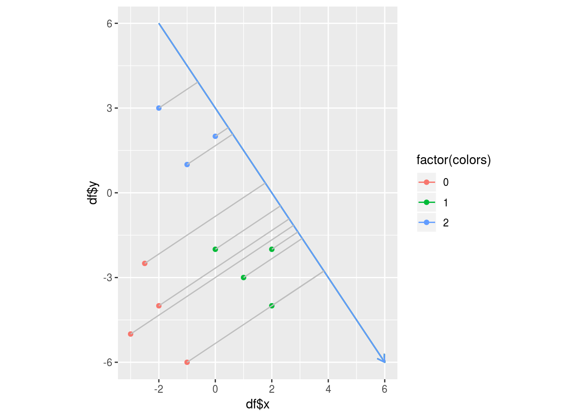
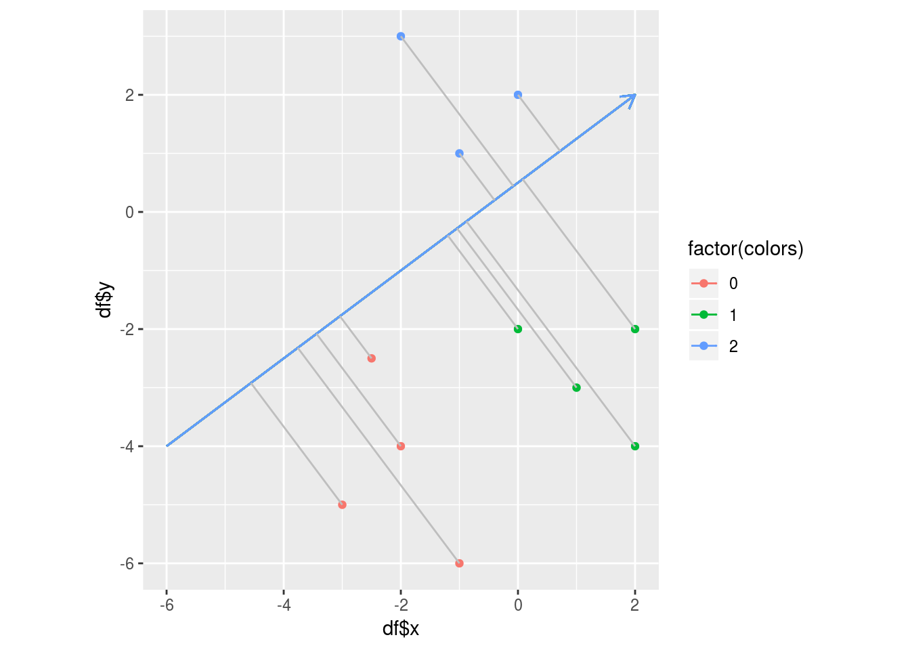

# Number of Fishers discriminants required

Consider that, in $$d=2$$, there are _K=3_ classes of data samples. Will 1 Fisher's discriminant still suffice to classify the data samples into 3 classes ? Take the example below. 

With 1 discriminant like below, 2 groups of blue and green wpoints are well seperated. But the red points are not seperated. We must add one more discriminant to the above plot in order to seperate the red points also as below. 

So, in this case, where $$K=3$$, we need 2 discriminants to seperate the 3 groups of points. Actually, given data _X_ in dimension _d_ belonging to _K_ output classes, the minimum number of Fisher's discriminants needed to seperate the _K_ groups of samples is $$min(K-1,d)$$. For the sake of understanding, the reader is encouraged to experiment with $$K > 3$$ in $$d=2$$ and find out the number of Fisher's discriminants necessary. 

To summarize, Fisher's discriminant analysis aims to find a suitable _w_ such that multiplying _X_ by _w_ will orthogonally project _X_ onto a lower dimensional subspace _Y_ in dimension $$d'=min(K-1,d)$$. That is, FDA tries to find _w_ such that:

> $$Y=X.w$$

_X_ is a $$[n,d]$$ dimension matrix. _w_is a $$[d, min(K-1,d)]$$ dimensional matrix. So, Y is a $$[n, min(K-1,d)]$$ matrix of orthogonal projections of the original dataset $$X$$ onto the Fisher's discriminant $$w$$. 

<a class="continue" href="chapter4.html">Next chapter</a>

